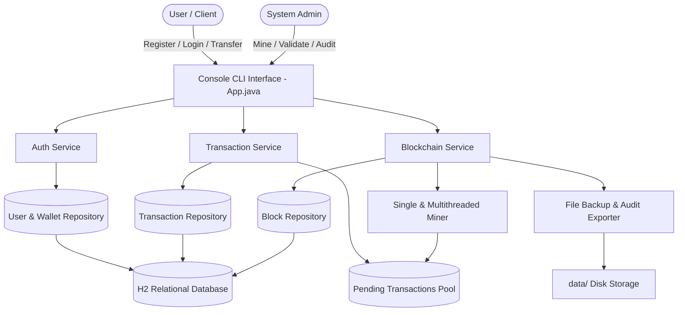
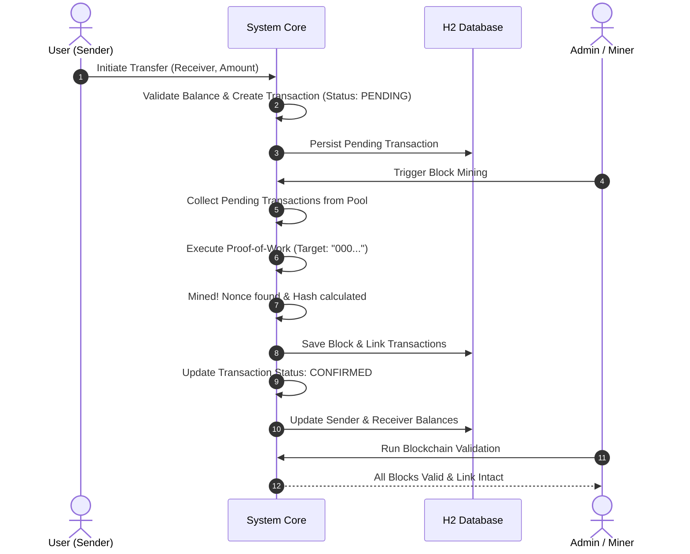
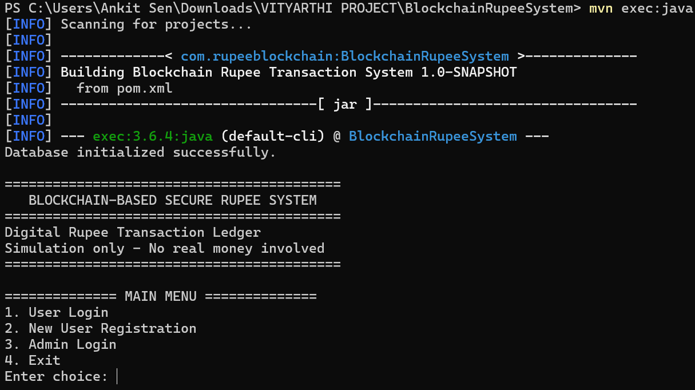
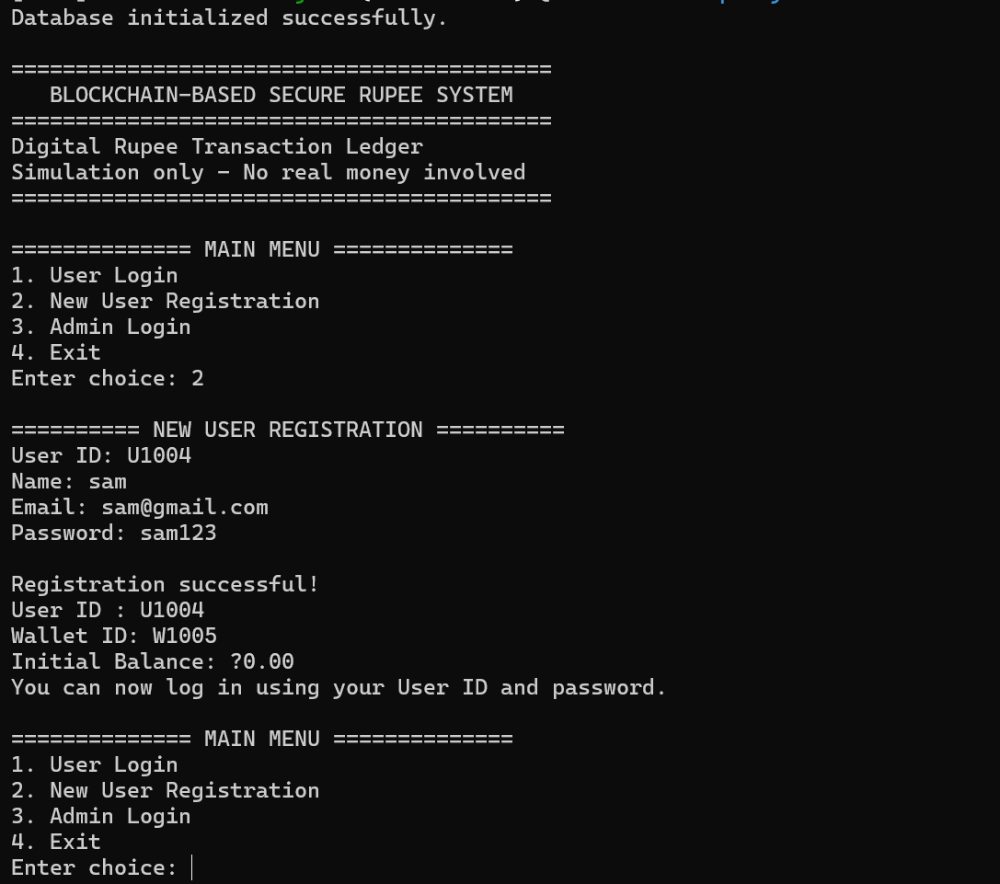
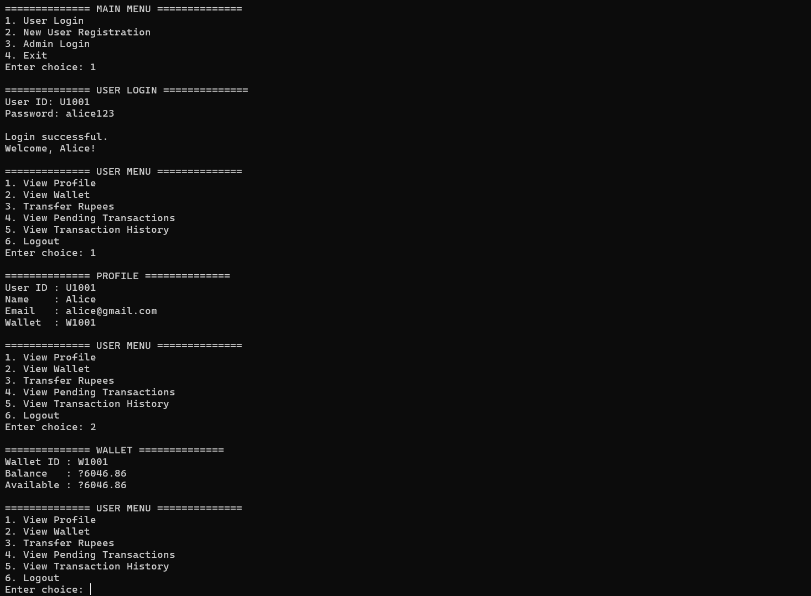
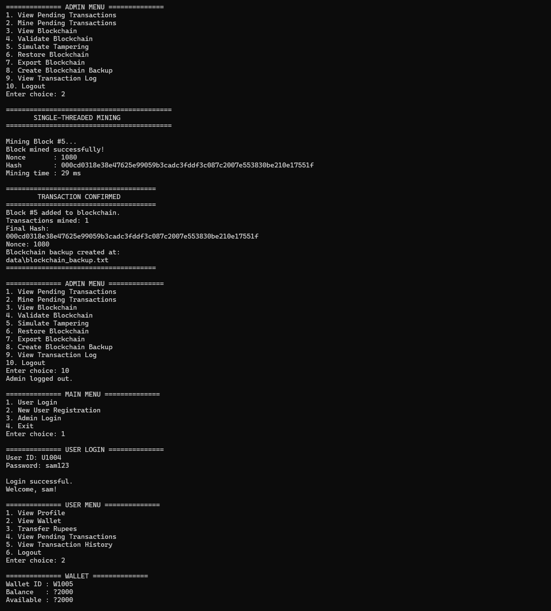
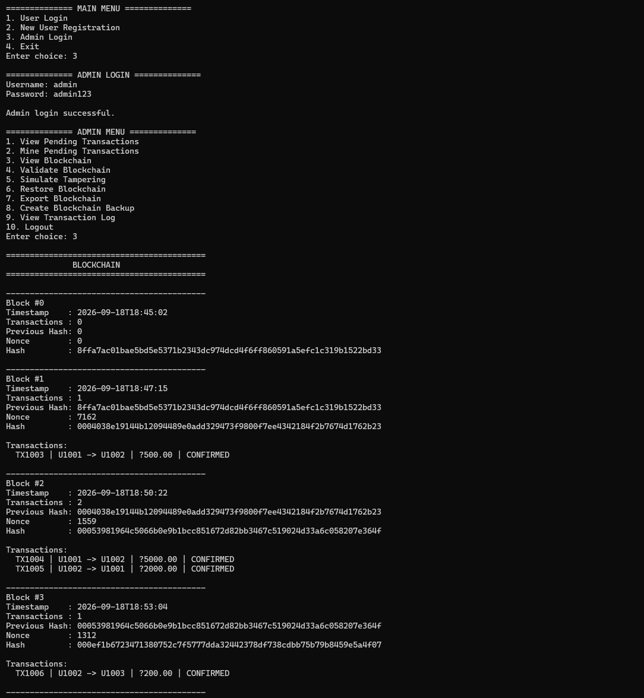

# Blockchain-Based Rupee Transaction System

[](https://www.oracle.com/java/)
[](https://maven.apache.org/)
[](https://www.h2database.com/)
[](https://junit.org/junit5/)
[](https://en.wikipedia.org/wiki/SHA-2)

A robust, full-featured academic simulation of a **Blockchain-Based Digital Rupee Transaction Ledger**. This system combines cryptographic hashing, distributed-style proof-of-work (PoW) consensus, persistent relational storage, and real-time tampering detection into a clean, modular Java architecture.

> **Disclaimer:** This software is developed strictly for academic and educational purposes (VITyarthi Project). It operates entirely as a local simulation—no real currency or financial institutions are involved.

---

## ⚡ Quick Access & Default Credentials

To run and evaluate the system immediately, launch the console application using:

```powershell
mvn exec:java
```

Use the following pre-configured credentials to log in:

| Portal / Role | User ID / Username | Password | Role & Permissions |
| :--- | :--- | :--- | :--- |
| **🛡️ Admin Portal** | `admin` | `admin123` | Mine pending transactions, validate blockchain integrity, simulate tampering, export backups |
| **👤 User Account 1** | `U1001` | `alice123` | Pre-seeded user with initial test balance for P2P transfers |
| **👤 User Account 2** | `U1002` | `bob123` | Pre-seeded user with initial test balance for P2P transfers |

> 💡 **Tip:** You can also register new citizen accounts dynamically with auto-generated Wallet IDs directly via **Main Menu Option 2**.

---

## Table of Contents
- [⚡ Quick Access & Default Credentials](#-quick-access--default-credentials)
1. [Project Overview & Objectives](#1-project-overview--objectives)
2. [Problem Statement & Solution](#2-problem-statement--solution)
3. [System Architecture & Workflow](#3-system-architecture--workflow)
4. [Functional Modules](#4-functional-modules)
5. [Non-Functional Requirements](#5-non-functional-requirements)
6. [Database & Storage Schema](#6-database--storage-schema)
7. [Tech Stack & Tools](#7-tech-stack--tools)
8. [Project Structure](#8-project-structure)
9. [Installation & Setup](#9-installation--setup)
10. [Execution & User Guide](#10-execution--user-guide)
11. [Testing & Verification](#11-testing--verification)
12. [Visual Demonstrations & Screenshots](#12-visual-demonstrations--screenshots)
13. [Key Challenges & Engineering Solutions](#13-key-challenges--engineering-solutions)
14. [Future Scope](#14-future-scope)

---

## 1. Project Overview & Objectives

Traditional digital banking relies on centralized ledgers vulnerable to single-point failure, unauthorized database alterations, and lack of verifiable audit trails. The **Blockchain-Based Rupee System** solves this by implementing an immutable, append-only distributed ledger pattern where every financial transfer is sealed in cryptographically chained blocks.

### Primary Objectives:
- **Cryptographic Immutability:** Guarantee transaction history cannot be rewritten or altered without breaking the mathematical hash chain.
- **Proof-of-Work Consensus:** Simulate multi-threaded block mining using difficulty targets and cryptographic nonces.
- **Transparent Auditability:** Provide instant verification tools to inspect the full chain from the Genesis Block (`Block #0`) to the latest confirmed block.
- **Tamper Resilience:** Detect unauthorized changes to transaction amounts, sender/receiver details, or sequence records in real time.

---

## 2. Problem Statement & Solution

| Traditional Centralized Systems | Blockchain Rupee System |
| :--- | :--- |
| Database records can be modified by rogue DB admins without trace | Any modified transaction invalidates block hash & breaks hash chain |
| Transactions can be forged or backdated | Deterministic timestamps, previous hash linking & cryptographic proofs |
| Hard to audit independently | Entire chain is self-validating through SHA-256 recalculation |
| Opaque transaction lifecycle | Transparent states: `PENDING` $\rightarrow$ `CONFIRMED` |

---

## 3. System Architecture & Workflow

### High-Level Architecture


### Transaction & Mining Lifecycle


---

## 4. Functional Modules

### Module 1: User & Wallet Management
- **Account Registration:** Creates a user profile with auto-generated unique Wallet IDs (`W1001`, `W1002`, etc.).
- **Authentication:** Secure credential validation for both standard users and administrative personnel.
- **Wallet Inspection:** Real-time balance display and wallet status tracking.

### Module 2: Transaction Engine & Memory Pool
- **Peer-to-Peer Transfer:** Validates sender liquidity, deducts amount, and stages the transfer.
- **Pending Memory Pool:** Holds staged transactions until confirmed by miners.
- **Transaction Ledger:** Tracks transaction IDs, timestamps, sender/receiver keys, amounts, and statuses (`PENDING`, `CONFIRMED`).

### Module 3: Blockchain Engine & Proof-of-Work Mining
- **Genesis Block Creation:** Auto-initializes Block #0 with fixed hash linking.
- **Proof-of-Work Mining:** Implements both single-threaded and multi-threaded worker pools to calculate the winning nonce matching target zero-prefixes.
- **Dynamic Ledger Appending:** Packages pending transactions, seals the block, and links it to `previousHash`.

### Module 4: Verification & Tampering Simulation
- **Chain Validator:** Iterates through every block, recalculates SHA-256 hashes, and ensures linkage continuity.
- **Tamper Simulator:** Allows controlled modification of transaction values inside confirmed blocks to demonstrate automatic fraud detection.
- **Rollback / Recovery:** In-memory and file-based state restore functionality.

### Module 5: Persistence & Audit Exporter
- **Relational Storage:** Embedded H2 database engine storing users, wallets, transactions, blocks, and block-transaction junction records.
- **Flat File Backups:** Automatic export of human-readable audit logs (`data/transaction_log.txt`, `data/blockchain_backup.txt`).

---

## 5. Non-Functional Requirements

- **Security:** SHA-256 cryptographic hashing on all block headers and transactions; transaction status immutability.
- **Performance:** Multi-threaded mining service leveraging Java concurrency (`ExecutorService` / workers) for fast PoW resolution.
- **Reliability:** ACID compliant transactional updates via H2 database, ensuring wallet balances and transaction states stay synchronized.
- **Maintainability:** Strict separation of concerns across Model, Service, Database Repository, and Application layers.
- **Usability:** Structured console UI with input validation, intuitive menus, and informative error messages.

---

## 6. Database & Storage Schema

The system uses an embedded H2 SQL database (`database/rupee_blockchain.mv.db`) with 5 relational tables:

```text
+-----------------------+          +-----------------------+
|         USERS         |          |        WALLETS        |
+-----------------------+          +-----------------------+
| user_id (PK)          |<---------| owner_id (FK)         |
| name                  |          | wallet_id (PK)        |
| email                 |          | balance               |
| password              |          +-----------------------+
+-----------------------+
           |
           v
+-----------------------+          +-----------------------+
|     TRANSACTIONS      |          |  BLOCK_TRANSACTIONS   |
+-----------------------+          +-----------------------+
| transaction_id (PK)   |<---------| transaction_id (FK)   |
| sender_id             |     +--->| block_index (FK)      |
| receiver_id           |     |    +-----------------------+
| amount                |     |
| transaction_time      |     |
| status                |     |
+-----------------------+     |
                              |
+-----------------------+     |
|        BLOCKS         |     |
+-----------------------+     |
| block_index (PK)      |-----+
| block_timestamp       |
| previous_hash         |
| hash                  |
| nonce                 |
+-----------------------+
```

---

## 7. Tech Stack & Tools

- **Programming Language:** Java 17+
- **Build & Dependency Tool:** Apache Maven 3.9+
- **Database:** H2 Database Engine (Embedded Mode, v2.3.232)
- **Hashing Algorithm:** SHA-256 (Java Cryptography Architecture)
- **Unit Testing Framework:** JUnit Jupiter 5.11.0 & Maven Surefire
- **Version Control:** Git & GitHub

---

## 8. Project Structure

```text
BlockchainRupeeSystem/
│
├── .mvn/                              # Maven wrapper configuration
├── data/                              # Generated transaction logs and blockchain backups
│   ├── blockchain_backup.txt
│   └── transaction_log.txt
├── database/                          # Embedded H2 Database persistent files
│   └── rupee_blockchain.mv.db
├── screenshots/                       # Output demonstration screenshots
├── src/
│   ├── main/java/com/rupeeblockchain/
│   │   ├── App.java                   # Console Entry Point & Interactive Menus
│   │   ├── database/
│   │   │   ├── BlockRepository.java   # SQL operations for blocks
│   │   │   ├── DatabaseManager.java   # Connection lifecycle & schema DDL
│   │   │   ├── TransactionRepository.java
│   │   │   ├── UserRepository.java
│   │   │   └── WalletRepository.java
│   │   ├── model/
│   │   │   ├── Admin.java             # Admin entity
│   │   │   ├── Block.java             # Block structure, hashing & PoW
│   │   │   ├── MiningResult.java      # Result wrapper for nonce & hash
│   │   │   ├── Transaction.java       # Digital rupee transaction model
│   │   │   ├── TransactionStatus.java # PENDING, CONFIRMED, FAILED
│   │   │   ├── User.java              # User identity model
│   │   │   └── Wallet.java            # Balance & transfer handler
│   │   └── service/
│   │       ├── AuthService.java       # User & Admin credentials
│   │       ├── BlockchainService.java # Ledger operations & validation
│   │       ├── FileService.java       # File exports & backups
│   │       ├── HashUtil.java          # SHA-256 hashing engine
│   │       ├── MiningWorker.java      # Thread worker for parallel mining
│   │       ├── MultithreadedMiningService.java
│   │       └── TransactionService.java# Staging & fee engine
│   └── test/java/com/rupeeblockchain/ # Automated test suite (20 Tests)
│       ├── AppTest.java
│       ├── BlockTest.java
│       ├── BlockchainValidationTest.java
│       ├── DatabaseTest.java
│       ├── HashUtilTest.java
│       ├── LoginTest.java
│       ├── RegistrationTest.java
│       ├── TransactionTest.java
│       ├── WalletBalanceTest.java
│       └── WalletTest.java
├── pom.xml                            # Project dependencies and build settings
├── README.md                          # Project documentation
└── .gitignore                         # Build artifact ignore list
```

---

## 9. Installation & Setup

### Prerequisites
1. **JDK 17 or higher** installed:
   ```powershell
   java -version
   ```
2. **Apache Maven** installed:
   ```powershell
   mvn -version
   ```

### Clone & Build
```powershell
# Clone the repository
git clone https://github.com/ankit25bai10915/Blockchain-Based-Rupee-System-.git

# Navigate into the project directory
cd BlockchainRupeeSystem

# Clean compile the source code
mvn clean compile
```

---

## 10. Execution & User Guide

### Running the Application
Launch the interactive command line interface:
```powershell
mvn exec:java
```

### Default Credentials

| Portal | User ID / Username | Password | Notes |
| :--- | :--- | :--- | :--- |
| **Admin Portal** | `admin` | `admin123` | Can mine blocks, validate chain, simulate tampering |
| **Pre-seeded User 1** | `U1001` | `alice123` | Default account with test balance |
| **Pre-seeded User 2** | `U1002` | `bob123` | Default account for transfer testing |

*(You can also register brand new users directly from Main Menu Option 2).*

---

## 11. Testing & Verification

The project includes an exhaustive unit test suite covering all critical blockchain, database, wallet, and cryptographic features.

### Run All Tests:
```powershell
mvn clean test
```

### Test Summary (20/20 Passing):
- `AppTest`: Verifies entry point initialization.
- `BlockchainValidationTest`: Validates Genesis block and chained blocks integrity through database reload cycles.
- `BlockTest`: Tests hash generation, nonce variance, and invalidation on tampering.
- `DatabaseTest`: Verifies connection health and existence of all 5 database tables.
- `HashUtilTest`: Tests SHA-256 consistency and collision-free hashing.
- `LoginTest` & `RegistrationTest`: Verifies user onboarding and credential checking.
- `TransactionTest`: Tests transaction creation and status transitions.
- `WalletBalanceTest` & `WalletTest`: Tests deposit, withdrawal, and overdraft protections.

---

## 12. Visual Demonstrations & Screenshots


### 1. Main Welcome Screen & Menu
*Displaying the application banner, system options (User Login, Registration, Admin Login, Exit).*




---

### 2. User Registration & Wallet Allocation
*Registering a new citizen account and automatically provisioning a unique Wallet ID.*




---

### 3. User Login & Wallet Balance Inspection
*Logging in as an authenticated user and inspecting the available Digital Rupee balance.*



---

### 4. Transferring Digital Rupees
*Sending Digital Rupees from Sender to Receiver, staging the transaction with `PENDING` status.*


---

### 5. Proof-of-Work Block Mining Execution
*Executing Proof-of-Work to find the golden nonce matching difficulty requirement `000...`.*



---

### 6. Blockchain Inspection & Ledger Explorer
*Viewing the completed blockchain blocks showing Index, Timestamp, Nonce, Previous Hash, and Current Hash.*




---

## 13. Key Challenges & Engineering Solutions

### Challenge 1: Timestamp Precision Mismatch in Hash Recalculation
- **Issue:** Blocks initially passed validation in memory, but after persisting to H2 and reloading, `Block #0` failed validation with `Stored hash does not match calculated hash`.
- **Root Cause:** Java's `LocalDateTime.now()` contains nanosecond precision (9 digits), whereas H2 SQL's standard `TIMESTAMP` column stores microsecond precision (6 digits). Truncating nanoseconds upon database load changed the string input to `SHA-256`, altering the resulting hash.
- **Solution:** Implemented deterministic timestamp normalization in `Block.java` using `DateTimeFormatter.ofPattern("yyyy-MM-dd'T'HH:mm:ss")` and truncated to seconds (`ChronoUnit.SECONDS`). Hash recalculations now produce identical results regardless of database roundtrips.

### Challenge 2: Multi-Threaded Mining Race Conditions
- **Issue:** Multiple concurrent worker threads calculating nonces concurrently risked overwriting winning states or burning CPU after a solution was already found.
- **Solution:** Implemented an `AtomicBoolean` cancel flag and coordinated thread interruption so all threads halt immediately when any worker finds a valid hash.

---

## 14. Future Scope

1. **Smart Contracts:** Programmable Digital Rupee features such as conditional subsidies and expiring voucher payments.
2. **P2P Network Sockets:** Transitioning from single-node simulation to true decentralized multi-node consensus over WebSockets.
3. **Web / GUI Dashboard:** Visual front-end built with React or JavaFX for dynamic graph rendering of blocks and transactions.
4. **Asymmetric Key Cryptography:** Implementing RSA / ECC public-private key pair transaction signing for non-repudiation.

---

## Author & Acknowledgements
- **Student Name:** Ankit Sen
- **Registration Number:** 25BAI10915
- **Institution:** VIT Bhopal
- **Project Name:** Blockchain-Based Rupee Transaction System
